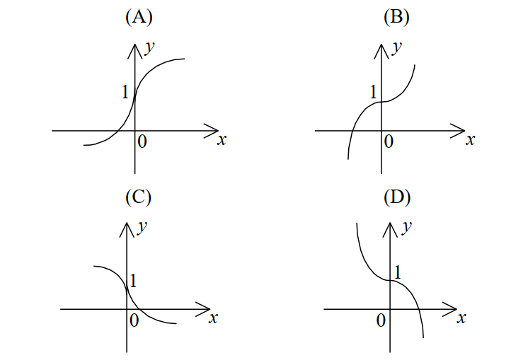

# 第4章练习题

## 一、单项选择题

1. 若 $f(x)$ 在 $(a,b)$ 内单调增加, 则必有().

   (A) $f'\left( x \right) < 0;$ 

   (B) $f'\left( x \right) > 0$;

   (C) $f'\left( x \right) \geq 0;$ 

   (D) A, B, C 都不对.

2. 函数 $y = f\left( x \right)$ 满足条件：$f\left( 0 \right) = 1,f'\left( 0 \right) = 0,$ 当 $x \neq 0$ 时, $f'\left( x \right) > 0,$ $f''\left( x \right)\left\{ \begin{matrix}
   \ < 0\ ,\ \ \ x < 0 \\
   \ > 0\ ,\ \ \ x > 0 \\
   \end{matrix}\ , \right.\ $ 它的图形是().

3. 设 $f\left( x \right) = \dfrac{\ln x}{x}$, 则使不等式 $\dfrac{\ln a}{a} > \dfrac{\ln b}{b}$ 成立的条件是().

   (A) $\ 0 < a < b;$ 

   (B) $e < a < b;$

   (C) $\ 0 < b < a;$ 

   (D) $e < b < a.$

4. 关于函数 $y = x - \ln x$ 的极值, 结论正确的是().

   (A) 有极小值 $1$; 

   (B) 有极大值 $1;$

   (C) 无极值 $e - 1$; 

   (D) 有极小值 $e - 1$*.*

5. 关于函数 $y = 2x - {\ln\left( 4x \right)}^{2}$ 的极值, 结论正确的是().

   (A) 有极大值 $2 - 4\ln 2;$ 

   (B) 有极小值 $2 - 4\ln 2;$

   (C) 无极值; 

   (D) 有极小值 $\dfrac{1}{2}.$

6. 曲线 $y = 3x^{2} - x^{3}$ 在().

   (A) $\left( 1, + \infty \right)$是凹的, $\left( - \infty,1 \right)$ 是凸的;

   (B) $\left( 1, + \infty \right)$是凸的, $\left( - \infty,1 \right)$ 是凹的;

   (C) $\left( 0, + \infty \right)$内是凸的, 在$\left( - \infty,0 \right)$是上凹的;

   (D) $\left( 0, + \infty \right)$ 内是上凹的, $\left( - \infty,0 \right)$ 是上凸的;

7. 曲线 $y = x^{2}\ln x$ 在点 $\left( \dfrac{1}{e^{4}},\dfrac{1}{e^{2}} \right)$ 近邻是().

   (A) 向上凸的; 

   (B) 向上凹的;

   (C) 左侧近邻向上凸, 右侧近邻向上凹;

   (D) 左侧近邻向上凹, 右侧的邻向上凸.

8. 曲线 $y = e^{- x^{2}}$ 的拐点情况是().

   (A) 没有拐点; 

   (B) 有一个拐点;

   (C) 有两个拐点; 

   (D) 有三个拐点.

9. 若 $\left( x_{0},f\left( x_{0} \right) \right)$ 为连续曲线 $y = f\left( x \right)$ 上的凹弧与凸弧分界点, 则().

   (A) $\left( x_{0},f\left( x_{0} \right) \right)$ 必为曲线的拐点;

   (B) $\left( x_{0},f\left( x_{0} \right) \right)$ 必定为曲线的驻点;

   (C) $x_{0}$ 为 $f\left( x \right)$ 的极值点;

   (D) $x_{0}$ 必定不是 $f\left( x \right)$ 的极值点.

10. 曲线 $\begin{cases}
     x = a(t - \sin t) \\
     y = a(1 - \cos t) \\
    \end{cases}(a > 0) $().

    (A) 有无穷多个拐点; 

    (B) 有两个拐点;

    (C) 无拐点; 

    (D) 有一个拐点.

11. 点 $(0,1)$ 是曲线 $y = ax^{3} + bx^{2} + c$ 的拐点, 则必有().

    (A) $a = 1,\ b = - 3,\ c = 1;$ 

    (B) $a$ 任意, $b = 0,\ c = 1;$

    (C) $a = 1,\ b = 0,$ $c$ 任意;

    (D) $b = - 3a$*,* $a$ 任意, $c = 1.$

12. 关于曲线 $y = \ln x$ 的渐近线, 下述结论正确的是().

    (A) 只有水平渐近线; 

    (B) 只有铅直渐近线;

    (C) 既有水平渐近线, 又有铅直渐近线 ;

    (D) 既没有水平渐近线, 也没有铅直渐近线.

13. $\lim\limits_{x \rightarrow \frac{\pi}{2}}\left( \dfrac{\cos 5x}{\cos 3x} \right)\,$= ()

    (A) $- 5\text{/}3;$ 

    (B) $- 1;$ 

    (C) $1;$ 

    (D) $5/3.$

14. 在区间 $\lbrack 0,8\rbrack$ 内, 对函数 $f\left( x \right) = \sqrt[3]{8x - x^{2}}$*,* 罗尔定理().

    (A) 不成立; 

    (B) 成立, 并且 $f'\left( 2 \right) = 0;$

    (C) 成立, 并且 $f'\left( 4 \right) = 0;$ 

    (D) 成立, 并且 $f'\left( 8 \right) = 0$.

15. 设 $f(x)\ $ 在 $\left\lbrack a,b \right\rbrack$ 上连续, 在 $\left( a,b \right)$ 内可导, 记(I) $f\left( a \right) = f\left( b \right)$;(II) 在 $\left( a,b \right)$ 内至少存在 $\xi$, 使 $f'\left( \xi \right) = 0$, 则().

    (A) (I) 是(II) 的充分但非必要条件;

    (B) (I) 是(II) 的必要但非充分条件;

    (C) (I) 是(II) 的充要条件;

    (D) (I) 是(II) 既非充分, 也非必要条件.

16. 设 $f(x) =  \begin{cases}
     3 - x^{2},& \text{ 当 }0 \leq |x| \leq 1 \\
    \dfrac{2}{x},& \text{ 当 }1 < |x| \leq 2 \\
    \end{cases} ,  $ 则在区间内 $(0,2)$ 满足 $f\left( 2 \right) - f\left( 0 \right) = f'\left( \xi \right)\left( 2 - 0 \right)$ 的 $\xi$ 值().

    (A) 只有一个; 

    (B) 不存在;

    (C) 有两个; 

    (D) 有三个.

17. 设 $a < b,ab < 0,f\left( x \right) = \dfrac{1}{x}$, 则在 $a < x < b$ 内使 $f\left( b \right) - f\left( a \right) = f'\left( \xi \right)\left( b - a \right)$ 成立的点 $\xi$ ().

    (A) 只有一点; 

    (B) 有两点;

    (C) 不存在; 

    (D) 是否存在,与 $a,b\ $ 的具体数值有关.

18. 设 $f(x)$ 有直至 $n + 1$ 阶导数, 则 $f\left( x \right) = \sum\limits_{k = 1}^{n}{\dfrac{f^{\left( k \right)}\left( 0 \right)}{k!}x^{k}} + R_{n}\left( x \right)$式中拉格朗日型余项 $R_{n}\left( x \right)$ =()(设 $0 < \theta < 1$).

    (A) $\dfrac{f^{\left( n \right)}\left( \theta x \right)}{n!}x^{n};$ 

    (B) $\dfrac{f^{\left( n + 1 \right)}\left( \theta x \right)}{\left( n + 1 \right)!}x^{n + 1};$

    (C) $\dfrac{f^{\left( n + 1 \right)}\left( x \right)}{\left( n + 1 \right)!}\left( \theta x \right)^{n + 1};$ 

    (D) $\dfrac{f^{\left( n + 1 \right)}\left( \theta \right)}{\left( n + 1 \right)!}x^{n + 1}$.

19. 已知函数 $f\left( x \right) = x^{3} + ax^{2} + bx$ 在点 $x = 1$ 处取得极值 $- 2$, 则().

    (A) $a = - 3,\ b = 0$ 且点 $\ x = 1\ $为函数 $f(x)$ 的极小值;

    (B) $a = 0,\ b = - 3$ 且点 $x = 1$ 为函数 $f(x)$ 的极小值;

    (C) $a = - 3,\ b = 0$ 且点 $x = 1$ 为函数 $f(x)$ 的极大值;

    (D) $a = 0,\ b = - 3\ $ 且点 $x = 1\ $为函数 $f(x)$ 的极大值.

20. 函数 $f\left( x \right) = \dfrac{\sqrt{x - 1}}{x\left( x - 1 \right)\left( x - 2 \right)}$ 的所有渐近线有$\underline{\qquad}$条.

    (A) $4;$ 

    (B) $3;$ 

    (C) $2;$ 

    (D) $1$.

## 二. 填空題

1. 曲线 $y = 1 - \sqrt[3]{x - 2}$ 的拐点是 $\underline{\qquad}$.

   

2. 设函数 $f(x)$ 在 $(a,b)$ 内可导且满足 $f'\left( x \right) \equiv 0$, 则在 $(a,b)$ 内 $f(x)\ $=  $\underline{\qquad}$.

   

3. 设函数 $f(x)$ 在 $x = 0$ 处具有二阶导数, 且 $f(0) = 0,$ $f'\left( 0 \right) = 1,$ $f''\left( 0 \right) = 3,$ 则极限 $\lim\limits_{x \rightarrow 0}\dfrac{f\left( x \right) - x}{x^{2}}$ = $\underline{\qquad}$.

   

4. $\lim\limits_{x \rightarrow 0}\dfrac{\ln{\cos a}x}{\ln{\cos b}x}$ 的值等于 $\underline{\qquad}$.

   

5. 设 $a > 0,$ 则 $\lim\limits_{x \rightarrow + \infty}\dfrac{\ln x}{e^{\text{ax}}}$ 的值等于 $\underline{\qquad}$.

   

6. $f\left( x \right) = x^{3}$ 在$\lbrack 0,1\rbrack$上满足拉格朗日中值定理的  $\underline{\qquad}$.

   

7. 函数 $f\left( x \right) = 1 - \sqrt[3]{x^{2}}$ 在 $\lbrack - 1,\ 1\rbrack$ 上不具有罗尔定理的结论, 其原因是由于 $f(x)$ 不满足罗尔定理的一个条件 $\underline{\qquad}$.

   

8. $\lim\limits_{x \rightarrow 0}\dfrac{3x - \sin 3x}{x^{3}}$ 的值等于 $\underline{\qquad}$.

   

9. $\lim\limits_{x \rightarrow + \infty}\dfrac{e^{x}}{x^{a}}$ =   $\underline{\qquad}$ ($a > 0$).

   

10. $\lim\limits_{x \rightarrow \pi}\dfrac{e^{\pi} - e^{x}}{\sin 3x - \sin x}$ 的值等于$\underline{\qquad}$.

    

11. $\lim\limits_{x \rightarrow 0}\dfrac{e^{3x} - 1 - x}{2x}$ 的值等于 $\underline{\qquad}$.

    

12. $\lim\limits_{x \rightarrow 0}\dfrac{e^{x^{2}} - \cos x}{x^{2}}$ 的值等于  $\underline{\qquad}$.

    

13. $\lim\limits_{x \rightarrow 0}\dfrac{x - \ln\left( 1 + x \right)}{x^{2}}$ 的值等于 $\underline{\qquad}$.

    

14. $\lim\limits_{x \rightarrow \pi}\dfrac{\tan nx}{\tan mx}$( 其中 $m,\ n$ 为正整数) 的值等于 $\underline{\qquad}$.

    

15. $\lim\limits_{x \rightarrow 0}\dfrac{x}{e^{x} - e^{- x}}$ 的值等于 $\underline{\qquad}$.

    

16. $\lim\limits_{x \rightarrow + \infty}\dfrac{x^{k}}{e^{x}}$( 其中 $k > 0$) 的值等于 $\underline{\qquad}$.

    

17. ${\lim\limits_{x \rightarrow + \infty}\left( \ln x \right)}^{1\text{/}x}$ = $\underline{\qquad}$.

    

18. $\lim\limits_{h \rightarrow 0}\dfrac{\ln\left( x + h \right) + \ln\left( x - h \right) - 2\ln x}{h^{2}}$ =  $\underline{\qquad}$.

    

19. 曲线 $y = \dfrac{x^{2}}{2x + 1}$ 的斜渐近线为 $\underline{\qquad}$.

    

20. 曲线 $y = \dfrac{e^{x}}{x + 1}$ 有个 $\underline{\qquad}$拐点.

## 三. 计算题

1. 判定函数 $f\left( x \right) = x + \cos x\left( 0 \leq x \leq 2\pi \right)$ 的单调性.

   

2. 求函数 $y = \left( x + 1 \right)^{4} + e^{x}$ 的图形的抛点及凹凸区间.

   
   
3. 求极限 $\lim\limits_{x \rightarrow \frac{\pi}{4}}\dfrac{\cos 2x}{e^{\sin 4x} - e^{\sin 8x}}$

   

4. 设 $f(x)$ 有一阶导数, $f\left( 0 \right) = f'\left( 0 \right) = 1$, 求 $\lim\limits_{x \rightarrow 0}\dfrac{f\left( \sin x \right) - 1}{\ln f\left( x \right)}$.

   
   
5. 求极限 $\lim\limits_{x \rightarrow 0}\dfrac{12^{x} - 5^{- 3x}}{\, 2\arcsin x - x}$

   

6. 求极限 $\lim\limits_{x \rightarrow 1}\dfrac{\tan{\ln\left( 3x - 2 \right)}}{e^{x + 1} - e^{x^{2} + 1}}$

   
   
7. 求极限 $\lim\limits_{x \rightarrow 0}\dfrac{\ln\left| \sin ax \right|}{\ln\left| \sin bx \right|}$ ( $a,b$ 都是不为 $0$ 的常数).

   
   
8. 试决定曲线 $y = ax^{3} + bx^{2} + cx + d$ 中的 $a,\ b,\ c,\ d,$ 使得 $x = - 2$ 处曲线有水平切线, $(1, - 10)$ 为拐点, 且点 $( - 2,\ 44)$ 在曲线上.

   
   
9. 求函数 $y = x^{5} - 5x^{4} + 5x^{3} + 1$ 在 $\lbrack - 1,2\rbrack$ 上的最大值, 最小值.

   
   
10. 求曲线 $y = \dfrac{e^{x}}{1 + x}$ 的渐近线.

    

## 四. 综合与应用题

1. 用长度为 $l$ 米( $\ l > 0$ )的篱笆在直的河岸边围成三面是篱笆一面是河的矩形场地, 求矩形场地的最大面积.

   
   
2. 要做一个圆锥形漏斗, 其母线长 20 cm, 要使其体积最大, 问其高应为多少?

   
   
3. 设有一块边长为 $a$ 的正方形铁皮, 从四个角截去同样的小方块, 做成一个无盖的方盒子, 问小方块的边长为多少才使盒子的容积最大?

   
   
4. 设某产品的销售量 $Q$ 与价格 $P$ 之间有关系式为 $Q = \dfrac{1 - P}{P}$

   (1) 求需求弹性 ;

   (2) 售价为 $0.5$ 时的需求弹性. 并给出经济解释.

   
   
5. 某厂生产某种商品, 其年销售量为 $100$ 万件, 每批生产需增加准备费1000元, 而每件的库存费为0.05元. 如果年销售是均匀的, 且上批销售完后, 立即再生产下一批（此时商品库存量为批量的一半), 问分几批生产, 能使生产准备费及库存费之和最小？

   
   
6. 某商品的价格 $P$ 与需求量 $Q$ 的关系为 $P = 10 - \dfrac{Q}{5}$

   (1) 求需求量为 $20$ 及 $30$ 时的总收益 $R$、平均收益 $\overline{R}$ 及边际收益 $R'$;

   (2) $Q$ 为多少时总收益最大？

   
   
7. 设 $f\left( x \right) = x^{3} + ax^{2} + bx$ 在 $x = 1$ 处有极值 $- 2$, 试确定系数 $a,\ b,$ 并求出 $y = f\left( x \right)$ 的所有极值点及拐点.

   
   
8. 在半径为 $R$ 的球内, 求体积最大的内接圆柱体的高.

   
   
9. 由三块同一宽度的板做成一个梯形的排水槽(无上盖), 问侧面与底的倾角 $\alpha$ 为多大时, 才使水槽的横断面积最大？

   
   
10. 将半径为 $r$ 的圆铁片, 剪去一个扇形, 问其中心角 $\alpha$ 为多大时, 才能使余下部分围成的圆锥形容器的容积最大?

    

## 五、证明题

1. 设 $f\left( x \right)$ 在 $\left\lbrack 1,e \right\rbrack$ 上连续, 在 $(1,\ e)$ 内可导, 且 $f\left( 1 \right) = 0,f\left( e \right) = 1,$ 证明方程 $xf'\left( x \right) = 1$ 在 $\left( 1,e \right)$ 内至少有一实根.

   
   
2. 设 $f\left( x \right)$ 在 $\left\lbrack a,b \right\rbrack$ 上可导, 证明存在 $\xi \in \left( a,b \right),$ 使$$\dfrac{1}{b - a}\left| \begin{matrix}
   b^{3} & a^{3} \\
   f\left( a \right) & f\left( b \right) \\
   \end{matrix} \right| = \xi^{2}\left\lbrack 3\, f\left( \xi \right) + \xi\, f'\left( \xi \right) \right\rbrack.$$

   
   
3. 设 $f\left( x \right)$ 在 $\left\lbrack 1,2 \right\rbrack$ 上连续, 在 $(1,\ 2)$ 内可导, 且 $f\left( 2 \right) = 0,$ 证明至少存在一点 $\xi \in \left( 1,2 \right),$ 使 $f'\left( \xi \right) = - \dfrac{f\left( \xi \right)}{\xi\ln\left( \xi \right)}$.

   
   
4. 设 $b > a > 0,$ 证明 ： $\ln\dfrac{b}{a} > \dfrac{2\left( b - a \right)}{a + b}.$

   
   
5. 证明当 $x \neq 0$ 时, 有不等式 $e^{x} > 1 + x.$

   

